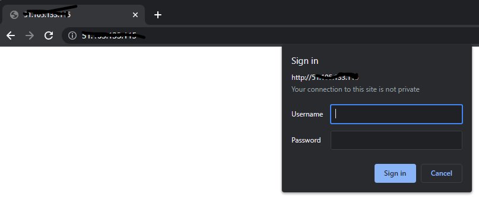
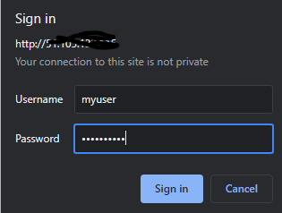
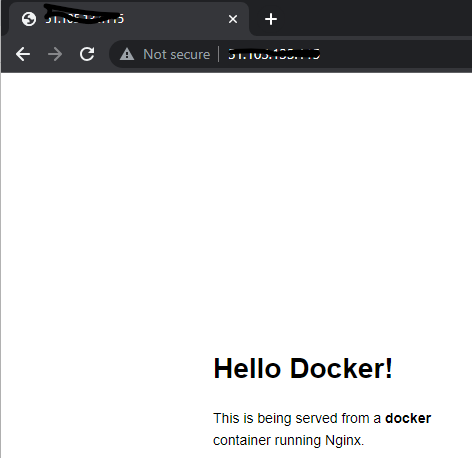

# Add Basic Authentication to a service in Kubernetes with NGINX
This repo is a sample of how to use NGINX as an authentication proxy for a service in Kubernetes AKS.

There can be a requirement to be able to provide some *basic* level of authentication to a service in an AKS cluster. NGINX has a number of these capabilities, so this repo describes how to configure NGINX for this.

It should be noted that there are no real secrets in this repo - just test ones for NGINX that can be applied to the NGINX deployment. So these credentials are of no use outside in the wider world.

## Create a Test Application.
It's useful to have a test application that is the target for the proxy. This is really simple and it is just about exposing a web application as a Kubernetes service internal to the cluster. You can bring your own, but one is supplied in this repo.

```
apiVersion: apps/v1
kind: Deployment
metadata:
  name: myapp
spec:
     replicas: 1
     selector:
       matchLabels:
         app: myapp
     template:
       metadata:
         labels:
           app: myapp
       spec:
         containers:
         - name: myapp
           image: dockersamples/static-site:latest
           ports:
           - containerPort: 80
---
apiVersion: v1
kind: Service
metadata:
  name: myapp
spec:
     selector:
       app: myapp
     ports:
     - name: http
       port: 80
       targetPort: 80
```
As can be seen above:
1. there is a deployment called myapp that uses an image *static-site*
2. This is exposed on port 80
3. There is a service *myapp* which also is exposed on port 80.

## NGINX Deployment and Configuration
The NGINX image is pulled directly from Docker hub and so does not need to be build locally. But there is need to configure NGINX. The configurations needed are:
1. General configuration of NGINX - as a proxy to our target app, using basic authentication
2. One or more usename and password pairs that the proxy will use to authenticate end users.

The configuration of the NGINX instance will be done by a Kubernetes Configmap and the passwords as a secret. I am not making any attempt in this repo to pull secrets from key vault - though that would be best practice normally, but this use case is all about quickly putting an authentication proxy on a service.

### NGINX Configuration
NGINX takes a JSON configiuration file and this will be later mounted into a path on the running container. To set this configuration, this is wrapped as a deployment.

```
apiVersion: v1
data:
  nginx.conf: |-
    events {
        worker_connections 1024;
    }
    http {
        server {
           listen 80;
           server_name myserver;

           location / {
               proxy_pass http://myapp:80;
               proxy_set_header Host $host;
               proxy_set_header X-Real-IP $remote_addr;
               proxy_set_header X-Forwarded-For $proxy_add_x_forwarded_for;
               auth_basic "Restricted Content";
               auth_basic_user_file /etc/nginx/.htpasswd;
           }
        }
    }
kind: ConfigMap
metadata:
  name: my-nginx-config
```
In the above:
1. the proxy listens on port 80
2. the target is defined as *myapp* on port 80 - this needs to match the app's service settings in the previous section
3. it looks for the password file at */etc/nginx/.htpasswd* - these will also need to be mounted into the running container in that path

### Password file Configuration
This is perhaps the most tricky part. There need to be one or more usename password pairs and these need to be obfuscated and then created as a secret that can be referenced by NGINX - it loads the secrets into a path in the container.

```
apiVersion: v1
data:
  .htpasswd: bXl1c2VyOiRhcHIxJHVDMVlsS1RLJGVJcGlsVXJiMy80Y09tVWdFWmxoZjEK
kind: Secret
metadata:
  name: nginx-htpasswd
  namespace: default
type: Opaque
```
In the above:
1. the secret is named *nginx-htpasswd*
2. the data is used to create a file called *.htpasswd* with that encoded value - this is a Base64 encoded list of username/password pairs. More on how this is created later.

If the above data is base64 decoded, you get:
```
myuser:$apr1$uC1YlKTK$eIpilUrb3/4cOmUgEZlhf1
```

The above can be created by the *htpasswd* [utility](https://httpd.apache.org/docs/2.4/programs/htpasswd.html) and can be used as below:

```
htpasswd -cb  .htpasswd myuser mypassword
```
In the above the username *myuser* with the password *mypassword* gets encoded and ouptut as the file .htpasswd. This then may be used in the above deployment for the secret.

### NGINX Deployment
Now that the config map and secret have been create in the cluster, it is time to deploy NGINX itself:

```
apiVersion: apps/v1
kind: Deployment
metadata:
  name: my-nginx
spec:
     replicas: 1
     selector:
       matchLabels:
         app: my-nginx
     template:
       metadata:
         labels:
           app: my-nginx
       spec:
         containers:
         - name: my-nginx
           image: nginx:latest
           ports:
           - containerPort: 80
           volumeMounts:
           - name: nginx-config
             mountPath: /etc/nginx/nginx.conf
             subPath: nginx.conf
           - name: auth-secret
             mountPath: /etc/nginx/.htpasswd
             subPath: .htpasswd
             readOnly: true
         volumes:
         - name: nginx-config
           configMap:
             name: my-nginx-config
         - name: auth-secret
           secret:
             secretName: nginx-htpasswd
---
apiVersion: v1
kind: Service
metadata:
  name: my-nginx
spec:
     type: LoadBalancer
     selector:
       app: my-nginx
     ports:
     - name: http
       port: 80
       targetPort: 80   
```
From above, you can see:
1. there is a deployment and a service
2. The service is of type *LoadBalancer* - which in this case it means a public IP address. You may or may not need this.
3. The image is the public nginx latest version
4. There are two volume mounts. One for the congifuration of NGINX. This is mapped to /etc/nginx/nginx.config in the container and it will contain all of the settings needed
5. The second volume mount is that of the secrets and it mounts these in a file at /etc/nginx/.htpasswd - this is read-only
6. Both the deployment and the service are exposeed on port 80.

# Testing
As the NGINX endpoint is set as LoadBalancer, it will expose a public IP address. To find this IP address:

```
>kubectl describe service my-nginx

Name:                     my-nginx
Namespace:                default
Labels:                   <none>
Annotations:              <none>
Selector:                 app=my-nginx
Type:                     LoadBalancer
IP Family Policy:         SingleStack
IP Families:              IPv4
IP:                       10.0.253.243
IPs:                      10.0.253.243
LoadBalancer Ingress:     <my-public-ip-address>
Port:                     http  80/TCP
TargetPort:               80/TCP
NodePort:                 http  30385/TCP
Endpoints:                10.244.2.39:80
Session Affinity:         None
External Traffic Policy:  Cluster
Events:                   <none>
```
The *Load balancer Ingress* setting will have your public IP address. 

In a browser enter the IP address - this is preferably done in an In-Private session:


Enter credentials:


Finally success - we have hit the main app.



# Troubleshooting

# Summary
